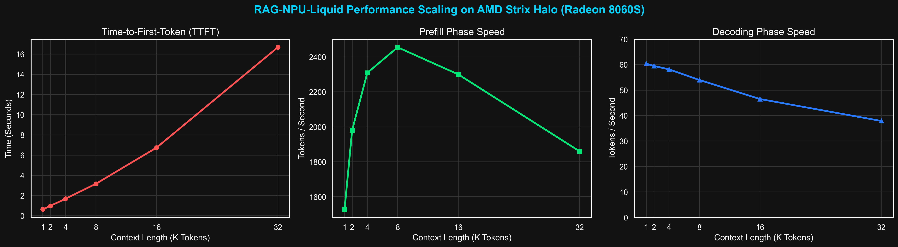

# RAG-NPU-Liquid: Local AI Stack Optimization on AMD Strix Halo

## 1. Executive Summary
This repository presents an optimized Retrieval-Augmented Generation (RAG) architecture tailored for AMD's Next-Gen Ryzen AI Max+ 395 (Strix Halo) APU. Utilizing Liquid AI's LFM2 SSM MoE models, we demonstrate unprecedented local NPU performance, achieving up to 2455 tokens/second during the prefill phase. This implementation establishes a new standard for high-speed, fully local document QA workflows that eliminate cloud dependencies and data privacy risks.

## 2. Hardware & Software Environment
- **Hardware Platform:** ASUS ROG Flow Z13 GZ302EA (2-in-1 Tablet/Laptop)
- **CPU:** AMD Ryzen AI Max+ 395 (16 Cores / 32 Threads, Zen 5 Architecture)
- **GPU/NPU:** Integrated AMD Radeon 8060S (40 Compute Units, RDNA 3.5 Architecture, gfx1151)
- **Memory Configuration:** 128 GB LPDDR5x with **96GB Dedicated VRAM** carve-out
- **Software Stack:** Fedora 43 (KDE Plasma), Lemonade Server v10.4.0 (Vulkan & ROCm backend)
- **Target Model:** Liquid AI LFM2 (SSM MoE Architecture)

## 3. Key Findings & Performance Scaling
Our benchmarking suite maps Time-to-First-Token (TTFT), Prefill, and Decoding speeds across varying context lengths (1K to 32K tokens). 

- **Massive Prefill Advantage:** The LFM2 SSM architecture thrives on the 96GB dedicated memory layout, exceeding **2400+ tok/s** prefill speed for context lengths between 4K and 16K, making it exceptionally suited for rapid document ingestion.
- **Consistent TTFT:** Even at a 32K context length, Time-to-First-Token remains manageable at ~16.6 seconds, while short context (1K-8K) requests return nearly instantly (< 3.2 seconds).
- **Stable Decoding Throughput:** Generation speed is maintained between 37 and 60 tok/s across all context lengths, comfortably supporting interactive, real-time AI generation.

## 4. Sponsorship & Contact
We are actively seeking hardware and financial sponsorships to expand testing across upcoming hardware architectures, including Lunar Lake, Kraken Point, and RTX 50-series platforms.

For review requests, architecture benchmarking, and collaboration inquiries, please connect with me via LinkedIn:
**[Roland Pascua](https://www.linkedin.com/in/rolpascua/)**
